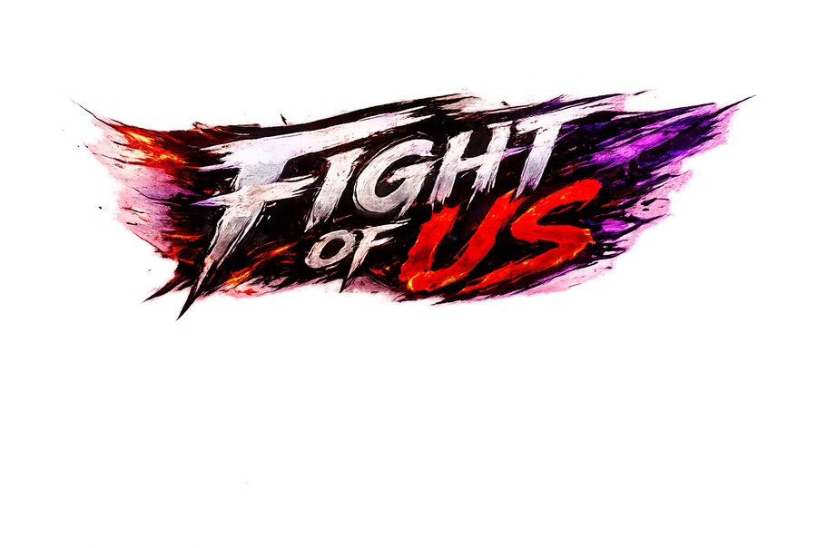

# Fight of Us

A browser-based 2D fighting game (HTML5 `<canvas>` + vanilla JavaScript, no build step, no dependencies). Pick a fighter, pick a stage, and brawl — locally against a friend or the CPU.

> The in-game UI is in Hungarian. This README is in English.



## Running the game

The game loads its art from real image files, so it must be served over HTTP (opening `index.html` from `file://` works in some browsers but a local server is recommended and matches how it deploys):

```bash
python3 -m http.server 8000
```

Then open <http://localhost:8000/>. Any static file server works (`npx serve`, nginx, GitHub Pages, etc.) — there is nothing to build.

## Controls

| Action | Player 1 | Player 2 |
| --- | --- | --- |
| Move | `A` / `D` | `←` / `→` |
| Jump | `W` | `↑` |
| Crouch | `S` | `↓` |
| Block (crouch block) | `E` (`S`+`E`) | `L` (`↓`+`L`) |
| Punch | `F` | `,` |
| Kick / sweep | `G` (`S`+`G`) | `.` (`↓`+`.`) |
| Throw | `F`+`G` | `,`+`.` |
| Berserk | `R` | `O` |
| Ultimate | `Q` | `/` |

Menus: `↑`/`↓` or `W`/`S` to move, `Enter`/`Space` (or `F`) to confirm, `Esc` to go back. A gamepad is also supported.

**Modes:** Versus (2-player or vs CPU with Easy/Normal/Hard/Insane AI) and Training. Story and Arcade are placeholders ("coming soon").
**Roster:** Krisz, Tomi, Laci, Barna (two more slots locked).
**Stages:** Akácfa Söröző, Morrison's 2, Laciverse, Siófok (day), Siófok (night), plus a random pick.

## Project structure

```
index.html            Markup only — links the stylesheet and the two scripts
css/styles.css        All styles (menu background points at assets/hud/menuBg.jpg)
js/assets.js          Asset manifest (window.ASSETS = { key → path }) — see "Asset pipeline"
js/game.js            The whole game (one IIFE): engine, AI, UI, animation
docs/                 Developer guides (adding-a-character.md)
tools/                Authoring helpers (atlas.js — slice sheets / generate clip config)
resources/            Original source art (character sheets, KARAKTEREK/, stage sources) — archive, not loaded
assets/
  characters/<id>/    Per-fighter sprites:
    base/             One image per pose: idle, walk, run, jump, block, punch, kick, hit, win, lose
    special/          Berserk alt-art (same 10 poses)
    ultimate/         Ultimate animation frames (+ projectile art where applicable)
    enter/            Spawn/entrance animation frames
    combat2/          Sweep, throw, being-thrown, knockdown, get-up, crouch
    combat2_special/  Berserk variants of the above (Barna)
    <pose>/           Multi-frame animation clips as 0.png, 1.png, … (e.g. Barna's walk/, punch/, …)
  stages/             Stage background photos
  ui/                 Ult-ready/used icons, round-win dots
  hud/                Logo, HUD frames, timer badge, menu background
```

Single-image characters (Krisz, Tomi, Laci) keep every pose in `base/`. Fully-animated characters (Barna) additionally have one folder per pose (`walk/`, `punch/`, …) holding the frame sequence — these are the engine's "clips".

## Architecture

- **`js/assets.js`** defines a single global `window.ASSETS` mapping every sprite/stage/UI key to its file path. It is generated — do not hand-edit it.
- **`js/game.js`** is one IIFE. Near the top it aliases the manifest (`const SPRITE_DATA = A.sprites`, etc.), so the rest of the engine reads paths exactly where it used to read inline data.
- **Lazy loading.** At startup only the four character portraits (`idle`) plus the HUD/UI images load. A fighter's full sprite set is built on demand by `ensureFighterLoaded(id)` — called from `enterVsScreen()` for both chosen fighters (the ~1.6 s VS screen covers decode time) and, defensively, from `drawFighter()`. Stages load on demand via `ensureStageLoaded(id)`. Every canvas draw already guards on `img.complete && img.naturalWidth`, so a sprite that is still decoding simply isn't drawn for a frame or two — no loading gate is needed. (Stage-select shows all stage thumbnails, so opening that screen loads the stage photos.)

## Asset pipeline

The game originally shipped as a single ~53 MB `fight_of_us.html` with all 322 images inlined as base64. It was migrated (one time) into this layout:

- every base64 blob was decoded to a file under `assets/**` (pixel-identical to what the game rendered), and `js/assets.js` was generated to map each key to its path;
- the `<style>`, `<script>` and markup were split into `css/styles.css`, `js/game.js` and `index.html`, with the inline data-URIs rewritten to file paths.

From here on, `assets/`, `js/`, `css/` and `index.html` are the source of truth — edit them directly (`js/assets.js` is a plain object you can hand-edit). The original monolith and the throwaway migration scripts are not kept in the tree; the pre-refactor `fight_of_us.html` remains in Git history (`git show HEAD:fight_of_us.html`) if it is ever needed. `resources/` holds the original source art (character sheets, `KARAKTEREK/`, stage sources); loose files that were byte-for-byte duplicates of the extracted `assets/` were deleted rather than archived.

## Adding content

- **A new fighter (or re-arting one):** follow **[docs/adding-a-character.md](docs/adding-a-character.md)** — the full walkthrough (art pipeline, manifest, roster entry + `portraitCrop`, the `CLIP_CONFIG`/`ULTIMATES`/`ENTER` config field-by-field, the hardcoded touchpoints, and how to test). The `tools/atlas.js` helper slices grid sprite-sheets and generates a starter clip config. `ensureFighterLoaded` in `js/game.js` picks up whatever asset categories exist for an id automatically.
- **A new stage:** add its photo to `assets/stages/`, an entry to the `stages` map in `js/assets.js`, and register it in `STAGE_LIST` / the stage grid in `js/game.js`.
